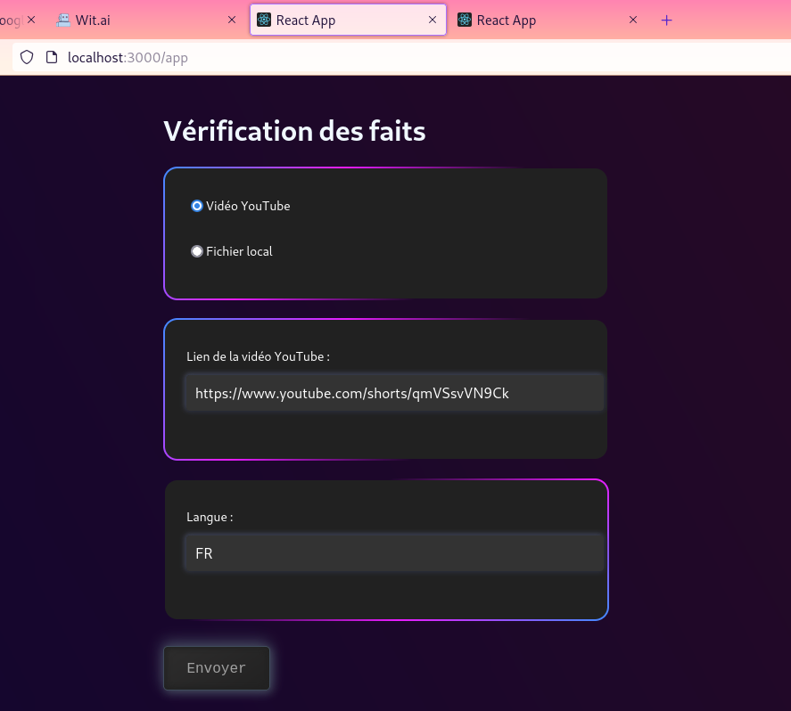
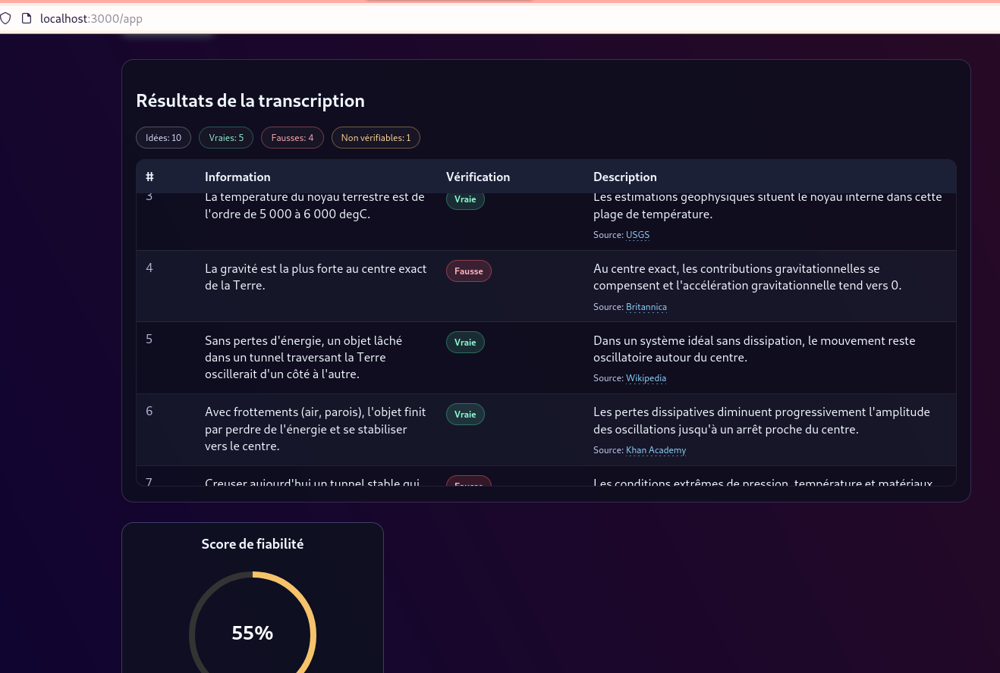
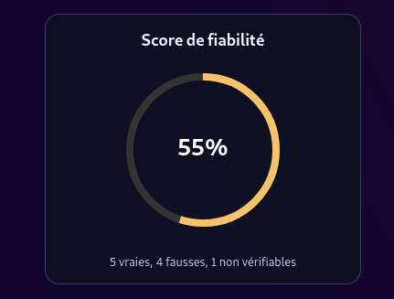

# FactAI

FactAI est une application de vérification de faits (Fact checking) à partir d'un fichier média (audio/vidéo) ou URL Youtube.
L'utilisateur indique un lien YouTube ou un fichier local (upload) en iput, l'application transcrit le contenu, extrait des informations, puis affiche un tableau de vérification lisible avec un score de fiabilité.

## Objectif du projet

- Transformer un contenu audio/vidéo en informations vérifiables.
- Proposer une lecture claire: `Information`, `Vérification`, `Description (avec sources)`.

## Méthodologie

### 1. Ingestion

- Entrée utilisateur via le frontend React:
  - URL YouTube
  - ou chemin de fichier local
- Envoi au backend Python -Flask- (`POST /api/transcribe`).



### 2. Pré-traitement média

- Conversion vers WAV avec `ffmpeg`.
- Téléchargement audio YouTube via `yt-dlp` si source YouTube.

### 3. Transcription

- Transcription via `tafrigh` + Wit.ai (selon langue et clés disponibles).
- Segmentation des phrases en idées plus structurées pour éviter des fragments hors contexte.



### 4. Vérification

- Vérification via OpenAI.
- Affichage d'un Tableau des vérifications avec un score de fiabilité:



## Stack technique

- **Frontend**: React
- **Backend**: Python, Flask
- **Audio/vidéo**: ffmpeg, yt-dlp
- **Transcription**: tafrigh + Wit.ai
- **IA (API LLM)**: Azure OpenAI/OpenAI selon config
- **Conteneurisation**: Docker

## Lancer le projet

## Prérequis

- Docker
- Node.js + npm

## 1) Lancer le backend (Docker)

Depuis la racine du projet:

```bash
cd transcribe
docker build -t transcribe-app .
docker run -it --rm \
  -p 5000:5000 \
  --env-file .env \
  -v $(PATH)/FactAI/transcribe/downloads:/usr/src/app/downloads \
  transcribe-app
```

Notes:

- Le backend expose l'API sur `http://localhost:5000/api/transcribe`.
- Le fallback fonctionne même si les services externes (api keys) ne répondent pas.

## 2) Lancer le frontend

Dans un autre terminal:

```bash
cd front
npm install
npm start
```

Frontend dispo sur:

- `http://localhost:3000/app`
